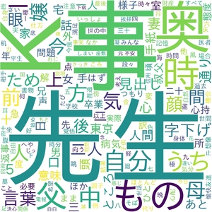
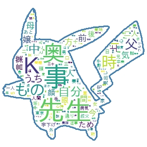

# Text Mining App

This application provides tools to extract useful information from text data.

## ① Word Cloud

### What is a Word Cloud?

A word cloud visually represents the frequency of words in a text. Words that appear more frequently are displayed larger.

### Example

(Natsume Soseki's *Kokoro*)

## ② Masked Word Cloud

### What is a Masked Word Cloud?

A masked word cloud generates a word cloud that follows the shape of a specified image, creating a more visually impactful representation.

### Example

(Natsume Soseki's *Kokoro*, Pikachu shape)

## ③ Frequency Table

### What is a Frequency Table?

A frequency table lists the occurrence count of each word in the text, allowing you to easily identify which words are used most frequently.

### Example

**Nouns**

| Word         | Frequency |
| -------- | -------- |
| 先生     | 600      |
| 事       | 574      |
| Ｋ       | 411      |
| 奥       | 401      |
| もの     | 395      |
| 時       | 389      |
| 父       | 296      |
| 自分     | 264      |
| 中       | 261      |
| ...      | ...      |

**Adjectives**

| Word         | Frequency |
| -------- | -------- |
| 長い     | 21       |
| 黒い     | 20       |
| なけれ   | 18       |
| なかろう | 17       |
| 悪く     | 16       |
| 強く     | 15       |
| 広い     | 14       |
| 高い     | 13       |
| 美しい   | 12       |
| 深い     | 12       |
| 暗い     | 12       |
| ...      | ...      |

**Verbs**

| Word         | Frequency |
| -------- | -------- |
| し       | 1,662    |
| い       | 957      |
| いう     | 547      |
| いる     | 481      |
| する     | 389      |
| あっ     | 349      |
| いっ     | 306      |
| 来       | 253      |
| なっ     | 251      |
| あり     | 231      |
| ある     | 229      |
| ...      | ...      |
